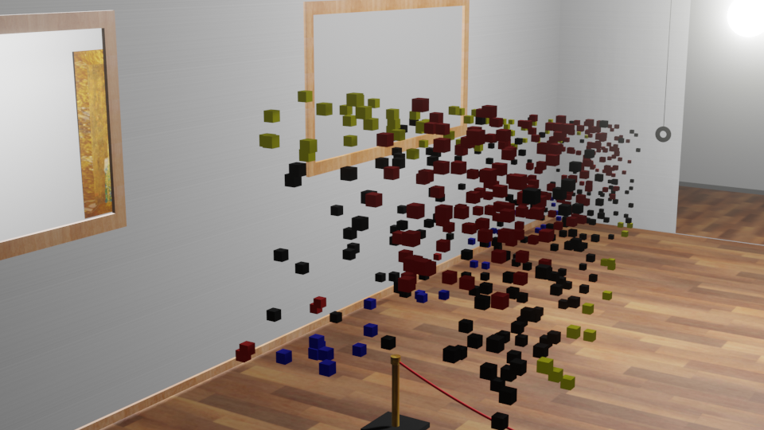
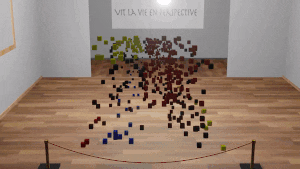

# question_de_perspective

# Dependencies
To be sure to have all the dependencies, you can create a conda environment using :

`conda env create -f env.yml`

You also need to install Blender : https://www.blender.org/download/

# Run an example
To run the program, do :

`sh main.sh $image $nb_frames $fps`

img = file name of the image you want to put in perspective (for example smiley). It will search for original picture in data/images and search as image.png

nb_frames = number of frames you want to render (for example 20)

fps = frame per second for the video (for example 10)

try it with the example : run 
`sh main.sh smiley 20 10`
at the root of the project

# What you can do with this project :
This project will create a random 3D projection of any image you want. For example, lets take the famous Mondrian painting :

The project will decompose each pixel to a cube, to create a perspective illusion. The illusion will be placed in a 3D rendered museum, like that :

Finally, it will automaticaly create a video to reveal the perspective :

You can also create your own pixel art using the command at the root of the project :

`ipython pixel_art.py` 

It will create a a blanck pixel art canvas, along with a color palette. You can now click on the color palette, and then 
paint it in the canvas !
When you're happy with your masterpiece, you can right click (or ctrl click) to save it !

(to do : make the size of the canvas customisable, add more colors, add a possibility to launch the perpsective program
directly from the pixel art)